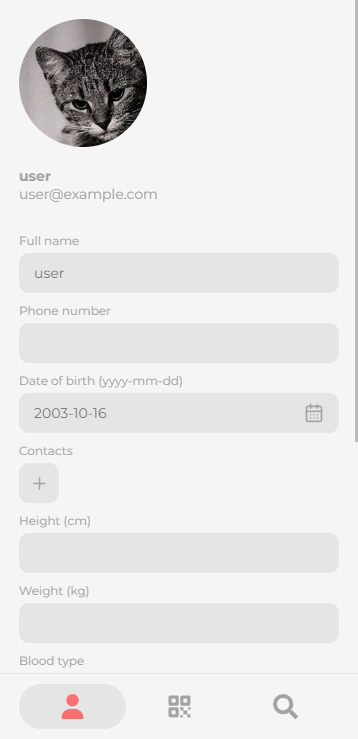

# Emergency Contact
#### Emergency Contact is a web and moblie app that allows doctors, nurses, and first-responders to access medical records and contact information in a matter of seconds via QR codes.

This repository contains the backend for Emergency Contact.

#### 🔗 [Visit the website](https://emergencycontact.vedantyadu.online/)
#### 🔗 [Backend Github repository](https://github.com/vedantyadu/emergency-contact-backend)

## Screenshots
<p float="left">
  
   
  
</p>

## Getting started
### Installing dependencies
```bash
npm install
```
### Changing backend origin
In [`/utils/utils.ts`](./utils/utils.ts), change the `configureAxios` function in the following format :
```js
export const configureAxios = () => {
  axios.defaults.baseURL = '<YOUR_BACKEND_SERVER_URL>'
  axios.defaults.withCredentials = true
}
```
### Starting development server
```bash
npx expo start
```
## Building the app
### Web
#### 🔗 [Expo docs](https://docs.expo.dev/workflow/web/)
```bash
npx expo export --platform web
```
### Mobile
#### 🔗 [Expo docs](https://docs.expo.dev/build/setup/)
```bash
eas build --platform all
```
